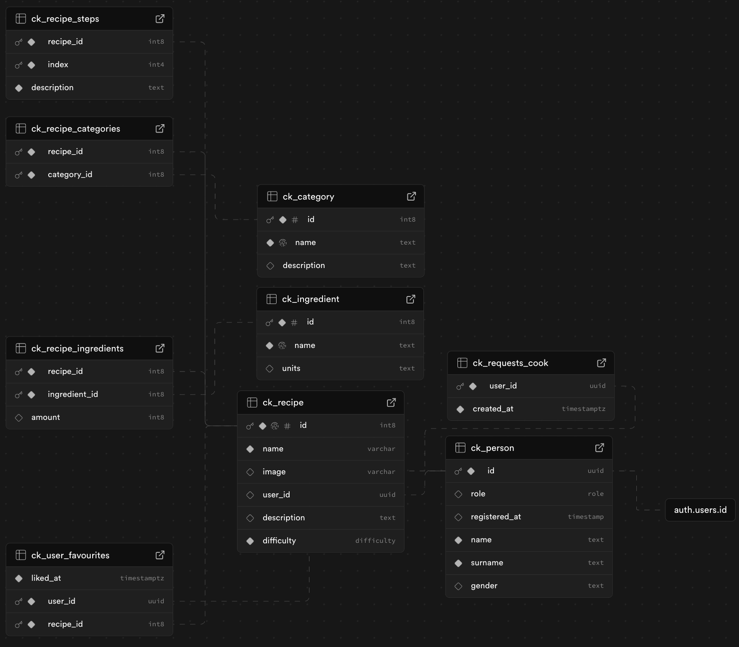

# 🥘 Cookerino

A web application for managing and sharing recipes built with **SvelteKit**, **Supabase**, and **Zod**.

## 🚀 Installation Guide

### Prerequisites
Make sure you have **Node.js** (v16 or later) installed. If you don’t have it, download it from [nodejs.org](https://nodejs.org/).

### 1️⃣ Clone the Repository
```sh
git clone https://github.com/yourusername/cookerino.git
cd cookerino
```

### 2️⃣ Install Dependencies
Run the following command to install all required dependencies:
```sh
npm install
```

### 3️⃣ Set Up Environment Variables

Create a .env.local file in the root directory and configure it as follows:
Run the following command to install all required dependencies:
```sh
PUBLIC_SUPABASE_URL=your_supabase_project_url
PUBLIC_SUPABASE_ANON_KEY=your_supabase_anon_key # Keep this secret!
```

Setup supabase like this and for testing you can disable RLS policies.


Make sure to replace the placeholders with actual values from your Supabase project.

## 📦 Installed Dependencies

### Dev Dependencies
These are required for development:
```sh
npm install -D @sveltejs/adapter-auto @sveltejs/kit @sveltejs/vite-plugin-svelte @tsconfig/svelte svelte svelte-check sveltekit-superforms typescript vite zod
```

### Runtime Dependencies
These are needed for the application to function:
```sh
npm install @supabase/auth-helpers-sveltekit @supabase/auth-ui-shared @supabase/auth-ui-svelte @supabase/ssr @supabase/supabase-js bootstrap superforms
```

## 🛠 Usage

### Development Server
Run the development server with hot-reloading:
```sh
npm run dev
```

## 🌟 Features
- **User Authentication** with Supabase
- **Recipe Management** (Create, Edit, Delete)
- **Favorite Recipes**
- **Categories & Filters**
- **Form Validation** using Zod
- **Responsive UI** 


Happy Cooking! 🍲🔥

